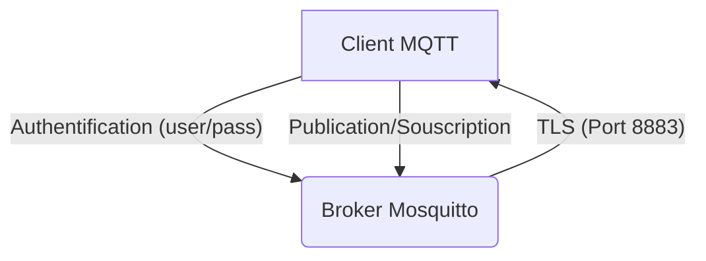
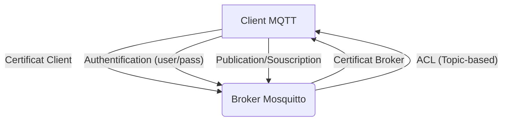

# Rapport d'Analyse des Vulnérabilités et Architectures Sécurisées MQTT

## Introduction
Ce rapport détaille les vulnérabilités potentielles d'une installation MQTT non sécurisée et propose des mesures de mitigation concrètes, ainsi que des schémas d'architecture sécurisée, conformément aux exigences des TP 2 et 3.

## 1. Vulnérabilités et Mesures de Mitigation

Le tableau suivant résume les principales vulnérabilités identifiées dans une configuration MQTT de base et les mesures de mitigation correspondantes.

| Vulnérabilité | Risque Associé | Mesure de Mitigation | Challenges/Obstacles |
|---|---|---|---|
| **Accès anonyme** | Accès non autorisé au broker, publication/souscription arbitraire, déni de service. | `allow_anonymous false` : Désactiver l'accès anonyme. | Nécessite la gestion des utilisateurs et des mots de passe. |
| **Communication en clair (MQTT sur port 1883)** | Attaques de type 
Man-in-the-Middle (MITM), écoute des communications, vol de données sensibles. | **TLS (Transport Layer Security)** : Chiffrement des communications sur le port 8883. | Complexité de la gestion des certificats (génération, signature, déploiement, renouvellement). |
| **Topics permissifs (ACL faibles)** | Publication/souscription sur des topics non autorisés, injection de données malveillantes, exfiltration d'informations. | **ACL (Access Control List)** : Définir des règles d'accès granulaires par utilisateur et par topic. | Nécessite une planification minutieuse des topics et des droits, maintenance complexe pour les grands déploiements. |
| **Authentification faible** | Attaques par force brute ou dictionnaire sur les identifiants. | Utilisation de mots de passe forts, gestion centralisée des utilisateurs (LDAP, etc.). | Complexité de la gestion des mots de passe, nécessité de politiques de sécurité robustes. |
| **Absence de journalisation** | Difficulté à détecter les intrusions, à analyser les incidents de sécurité. | Configuration de la journalisation détaillée du broker. | Volume de logs important, nécessité d'outils d'analyse de logs. |
| **Exposition des ports non nécessaires** | Augmentation de la surface d'attaque. | Restriction des ports ouverts via un pare-feu (`ufw`). | Nécessite une bonne connaissance des ports utilisés par MQTT et les services associés. |

## 2. Architectures Sécurisées

### 2.1 Architecture de base avec Authentification et TLS

**Description :** Dans cette architecture, les clients MQTT s'authentifient auprès du broker à l'aide d'un nom d'utilisateur et d'un mot de passe. Toutes les communications sont chiffrées via TLS sur un port dédié (généralement 8883), protégeant ainsi contre les écoutes et les attaques MITM.

### 2.2 Architecture avec ACL et mTLS (Mutual TLS)

**Description :** Cette architecture renforce la sécurité en ajoutant le mTLS, où le client et le broker s'authentifient mutuellement via des certificats X.509. Les ACL sont également mises en œuvre pour contrôler finement les droits de publication et de souscription de chaque utilisateur sur des topics spécifiques.

## 3. Questions du TP

### 1. Quels risques si MQTT non sécurisé ?
Un broker MQTT non sécurisé expose à de nombreux risques, notamment :
*   **Accès non autorisé :** N'importe qui peut se connecter au broker, publier ou souscrire à des messages.
*   **Écoute clandestine (Eavesdropping) :** Les données sensibles transmises en clair peuvent être interceptées.
*   **Usurpation d'identité (Spoofing) :** Un attaquant peut se faire passer pour un client ou un broker légitime.
*   **Injection de données malveillantes :** Des messages falsifiés peuvent être injectés dans le système, entraînant des comportements erronés des appareils IoT.
*   **Déni de service (DoS) :** Un attaquant peut inonder le broker de messages, le rendant indisponible.
*   **Exfiltration de données :** Des informations confidentielles peuvent être lues et extraites du système.

### 2. Différence entre TLS et mTLS ?
*   **TLS (Transport Layer Security) :** Le client vérifie l'identité du serveur à l'aide de son certificat. Le serveur ne vérifie pas l'identité du client. C'est le mode de fonctionnement courant pour la navigation web (HTTPS).
*   **mTLS (Mutual Transport Layer Security) :** Le client et le serveur se vérifient mutuellement. Le client vérifie le certificat du serveur, et le serveur vérifie le certificat du client. Cela offre un niveau de sécurité plus élevé car les deux parties doivent prouver leur identité.

### 3. Pourquoi utiliser les ACL ?
Les ACL (Access Control Lists) sont essentielles pour implémenter un **contrôle d'accès granulaire** dans un système MQTT. Elles permettent de définir précisément qui (quel utilisateur) a le droit de faire quoi (lire, écrire) sur quels topics. Sans ACL, un utilisateur authentifié pourrait potentiellement accéder à tous les topics, ce qui est un risque majeur dans un environnement IoT où différents appareils ont des besoins d'accès très spécifiques. Les ACL permettent de limiter la portée des actions d'un utilisateur et de minimiser les dommages en cas de compromission d'un compte.

## Conclusion
La sécurisation d'un déploiement MQTT est cruciale pour protéger les systèmes IoT. En combinant l'authentification, le chiffrement TLS/mTLS et des ACL bien définies, il est possible de construire une architecture robuste face aux menaces courantes.
